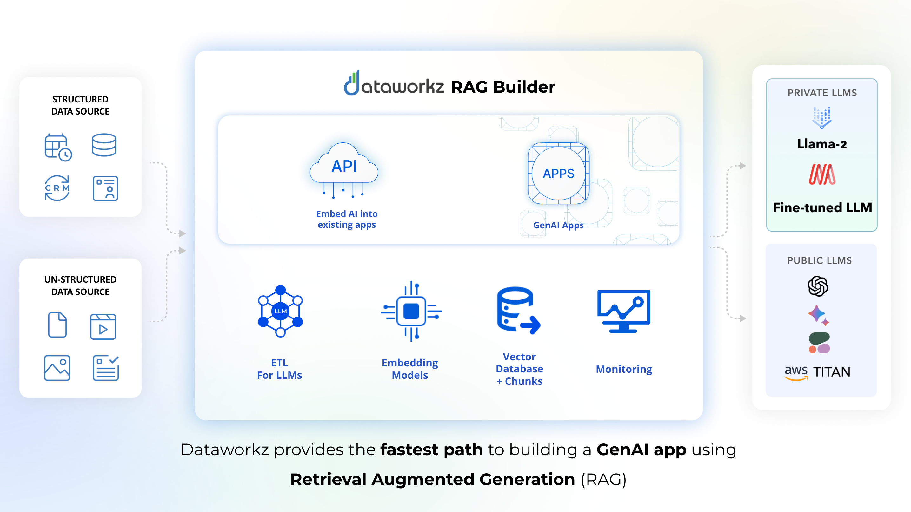

# Running the Dataworkz Sample QnA Application
This repo provides a sample QnA application powered by the Dataworkz RAG Builder that demonstrates the power of RAG on several datasets. In this section, we will show you how to get the sample QnA application running on your local machine.
Jump here to learn more about [Dataworkz RAG Builder](#what-is-dataworkz)

1. Clone Repository dataworkz-qna-app using `git clone https://github.com/dataworkz-dev/dataworkz-qna-app.git` .

2. If required, install node.js for your platform (Node Version > 16.0.0).

3. Run `npm install` to install dependencies.

4. You will need a Dataworkz API Key to access the Dataworkz RAG QnA Service. Here are the steps to [generate an API Key](generate-api-key).
   Note:
   - *Use Social Login or login with Authentication Providers*
   - *The API key name has to be unique across all users so please choose a name accordingly.*

6. Place your generated API Key in `token.txt` file. 
You can find the file at `src/assets/token.txt`.

7. Run `npm run start` to run a local web server that hosts the sample QnA application. To access the application, open a browser and navigate to `http://localhost:4200`
   
Please report any issues with the sample QnA application in [Issues](https://github.com/dataworkz-dev/dataworkz-qna-app/issues) 

# What is Dataworkz?
[Dataworkz](https://dataworkz.io) simplifies RAG app development for businesses. Dataworkz offers RAG as a Service so that you can build GenAI applications using proprietary data, utilizing either public LLM APIs or privately hosted open source foundation models.

## Dataworkz RAG Builder
Dataworkz’s RAG builder streamlines building GenAI applications to remove the complexity associated with stitching together a turnkey solution. A composable AI stack provides the ability to choose the vector database, embedding model, chunking strategy and LLM model. You have the flexibility use public LLM APIs including AWS Bedrock and OpenAI or host an open-source model in a VPC.

For Advanced RAG applications, Dataworkz provides the ability to combine lexical and semantic search with metadata filtering thereby enabling RAG apps to process large volumes of unstructured, semi-structured or structured data. 

### Connecting to your data
Dataworkz connects to different sources of business data - SaaS services, relational databases, NoSQL databases, files stored in cloud object stores and provides no-code transformations to make proprietary data in any format ready for LLM applications. When combining data from multiple sources, you can also configure the precedence order for input sources used to build the context for generating LLM response. The complete list of connectors is available [here](https://www.dataworkz.com/connectors/). 

### API for embedding RAG into your application/workflows
RAG builder provides an API for any developer to embed GenAI applications into their existing workflow with complete flexibility to customize the look and feel. The sample application in this repo leverages this API for its functionality. We have a section on the API integration into this app as well as how to use it in your own applications.

### Hallucinations and RAG
The emergence of hallucinations presents a notable obstacle in the widespread adoption of Gen AI within enterprises. Dataworkz enables GenAI to reference its origins, consequently enhancing traceability. Read the Dataworkz  [blog](https://www.dataworkz.com/2023/12/21/how-to-evaluate-response-of-a-rag-empowered-llm/) on how Dataworkz evaluates the response of an LLM.

## API Usage Notes
In this section, we provide some developer notes on how the sample application was built and what [APIs](https://docs.dataworkz.com/product-docs/api) were used to power various sections. You can try out the API and Question and Answer system integrated into your own application. You can generate an API Key (if already generated, the same key can be used) and connect to this service.

The example QnA application connects to `https://mongodb.dataworkz.com` as the backend RAG service. Dataworkz has provided a number of sample datasets (called QnA systems) to try using the RAG QnA API against. The example QnA application lists out all the datasets and lets the user ask questions against them. These example QnA systems have been configured with MongoDB as a vector database and demonstrate Dataworkz RAG capabilities with MongoDB and integrate a variety of popular Large Language Models (OpenAi GPT, Google Gemini, Llama-2).

### Authentication
Please refer to the [API Key Generation](https://docs.dataworkz.com/product-docs/api-key-generation/generate-api-key-in-dataworkz) section on how to get an API Key and how to use it to invoke Dataworkz QnA APIs. In the example QnA application, the API token is passed in the `Authentication` header using the form `SWSS <api-key>`.

### Listing QnA systems
Dataworkz RAG Builder supports configuring multiple, isolated QnA systems. QnA systems are used as domains of Question and Answer systems and can be leveraged for separation amongst multiple projects, groups of sources, large language models, versions, or different unrelated sub-domains in a project, etc. An application may have one or more QnA systems. When a question is asked, it is asked against a specific QnA system. 

The QnA example application  starts out with listing all the QnA systems (as cards) for the user to select the one she is interested in. Application developers can choose to list the systems for user selection or if the choice is clear from the context then set it up in code. 

Here's the API to list all available QnA systems - [https://mongodb.dataworkz.com/api/qna/v1/systems](https://docs.dataworkz.com/product-docs/api#qna-v1-systems).
The selected QnA systemId will be needed in subsequent APIs.

#### QnA system details
Information on each individual QnA system is retrieved using this API - [https://mongodb.dataworkz.com/api/qna/v1/systems/{systemId}](https://docs.dataworkz.com/product-docs/api#qna-v1-systems-systemid). This is used in the example QnA application to populate the individual QnA system cards.

### Large Language Model (LLM) Providers
Questions are answered by LLMs configured in the Dataworkz RAG Builder. LLMs configured for sample systems are OpenAI GPT 3.5, a privately hosted Llama-2 model, and Google's Gemini Pro (this list could change in the future). This API provides a list of configured LLMProviders by QnA system - [https://mongodb.dataworkz.com/api/qna/v1/systems/{systemId}/llm-providers](https://docs.dataworkz.com/product-docs/api#qna-v1-systems-systemid-llm-providers)

The example QnA application uses this to populate the LLMProviders drop down to allow the user to select the LLM they want to use to answer the question.
You should store the id of the LLMProvider you wish to use to ask questions to. Questions can be asked to specific LLM providers identified by the `llmProviderId` returned by this API call.

### Asking a question
The API to ask a question to the Dataworkz QnA system is [https://mongodb.dataworkz.com/api/qna/v1/systems/{systemId}/answer](https://docs.dataworkz.com/product-docs/api#qna-v1-systems-systemid-answer)

This API needs the `systemId` of the QnA system you are targetting and the `llmProviderId` of the LLM to use. The example QnA application leverages this API to power the "Knowledge Search" page. The response of this API includes the response from the LLM as well as links to the authoritative sources that back up the answer.

### Question History
The example QnA application provides a list of previously asked questions from a QnA system. This is a convenience method for users to look at previously answered questions. The following API is used - [https://mongodb.dataworkz.com/api/qna/v1/systems/{systemId)/questionshistory](https://mongodb.dataworkz.com/api/qna/v1/systems/{systemId}/questionshistory)

#### Previously Answered Questions
Dataworkz provides a list of previously answered questions along with additional scores and analysis on the quality of the answer. Read more about this here. The example QnA application uses this API to provide details on each answered question - [https://mongodb.dataworkz.com/api/qna/v1/systems/{systemId}/questions/{questionId}](https://docs.dataworkz.com/product-docs/api#qna-v1-systems-systemid-questions-questionid)

